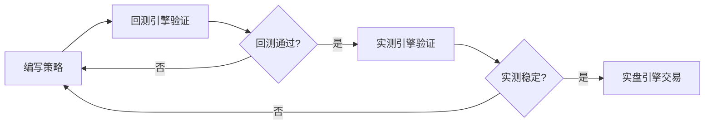

# 币安量化交易框架--Quantitative-Framework
能够实现量化回测，实测，实盘的工具，对接币安API
# 币安量化交易框架完整使用说明


## 一、框架概述
本框架是基于币安交易所的量化交易工具，支持**回测引擎、实测引擎、实盘引擎**三种模式，覆盖从策略开发到真实交易的全流程。通过导入自定义策略，可实现价格监控、信号生成、自动下单（开仓/平仓/强平）等功能，并提供详细的交易日志和订单记录，帮助用户验证策略有效性并执行交易。


## 二、环境准备
### 1. 安装Python环境
- 要求：Python 3.7及以上版本（推荐3.9）
- 下载地址：[Python官网](https://www.python.org/downloads/)
- 安装注意：勾选“Add Python to PATH”，确保环境变量配置正确


### 2. 安装依赖库
#### 方式1：自动安装（推荐）
运行“一键配置环境.py”脚本：
```bash
python 一键配置环境.py
```

#### 方式2：手动安装
若自动安装失败，执行以下命令：
```bash
pip install requests pandas python-binance tkinter
```
> 说明：`tkinter`通常随Python自带，Linux系统可能需单独安装（如Ubuntu：`sudo apt-get install python3-tk`）


### 3. 网络与VPN准备
- 币安部分服务在国内可能受限，需提前准备可用VPN并确保网络稳定，避免价格获取、实盘交易等功能受影响。


## 三、三种引擎模式详解
### （一）回测引擎：历史数据验证
#### 核心用途
基于历史K线数据验证策略的历史有效性，适合新策略开发初期测试逻辑是否盈利。

#### 数据来源
币安历史K线数据（包含开/高/低/收价格）。

#### 操作步骤
1. **配置数据**：  
   - 在「数据设置」选择交易对（如BTCUSDT）、时间范围（如2024-01-01至2024-02-01）、时间周期（如1h）；  
   - 点击「获取数据」下载历史K线。  

2. **导入策略**：选择策略文件（.py），点击「导入策略」，确保无语法错误。  

3. **启动回测**：  
   - 勾选「启用强平机制」（可选，模拟保证金不足强平）；  
   - 点击「开始回测」，框架会逐行处理历史数据，生成信号并模拟交易；  
   - 结果展示：「回测结果」区域显示收益率、胜率、最大回撤等，「交易订单列表」记录每笔虚拟订单。  


### （二）实测引擎：实时行情模拟
#### 核心用途
基于实时行情验证策略的适应性，无真实资金风险，适合回测通过后测试信号稳定性。

#### 数据来源
币安实时价格API（逐周期获取，与实盘数据源一致）。

#### 与其他模式的区别
- 对比回测：使用“实时逐周期数据”，更贴近真实交易节奏；  
- 对比实盘：仅虚拟交易，不涉及真实资金，可长期运行测试。

#### 操作步骤
1. **前置准备**：  
   - 「数据设置」选择交易对和周期（如5m，每5分钟获取一次价格）；  
   - 导入策略后点击「盘前预热」，用历史数据测试兼容性。  

2. **启动实测**：  
   - 点击「开始价格监控」，框架启动独立线程获取实时价格；  
   - 自动模拟开仓/平仓，「实测结果」区域实时更新：运行时长、保证金余额、未实现盈亏等。  

3. **停止实测**：点击「停止价格监控」，保留所有虚拟订单记录。  


### （三）实盘引擎：真实交易执行
#### 核心用途
用真实资金执行交易，适合实测验证无问题后的策略落地。

#### 数据来源
币安实时价格API + 账户信息API（同步真实余额和持仓）。

#### 操作步骤
1. **绑定API**：  
   - 币安官网创建API（需开启期货权限，关闭IP限制或添加当前IP）；  
   - 输入API Key和Secret，点击「绑定API」，提示“绑定成功”即生效。  

2. **配置参数**：  
   - 点击「刷新账户」同步真实USDT余额；  
   - 设置杠杆倍数（框架会自动同步到币安账户）、手续费率、下单模式等。  

3. **启动实盘**：  
   - 点击「开始实盘交易」，框架按周期获取价格和账户信息，调用币安API执行真实下单；  
   - 「实盘结果」区域实时更新：交易次数、总权益（保证金+未实现盈亏）等。  

4. **停止实盘**：点击「停止实盘交易」，已开仓订单需手动在币安后台平仓。  


## 四、策略写法规则
策略文件必须严格遵循以下规则，否则引擎会报错。

### （一）核心函数要求
#### 1. 函数名与参数
- **函数名**：必须为 `trade_signal`（大小写敏感）；  
- **参数**：仅允许两个输入参数——  
  - `time`：当前价格的时间戳（字符串，如“2024-05-20 14:30:00 open”）；  
  - `price`：当前价格（浮点数，如60000.5）。  


#### 2. 返回值规则
必须返回以下6种信号之一（字符串格式）：
| 信号       | 含义                 |
|------------|----------------------|
| "做多"     | 开多仓               |
| "做空"     | 开空仓               |
| "平多"     | 平掉所有多仓         |
| "平空"     | 平掉所有空仓         |
| "不操作"   | 无交易动作（推荐）   |
| None       | 等同于“不操作”       |


### （二）数据处理规则
1. **用全局变量存储历史数据**（框架不提供数据存储）：  
   ```python
   import pandas as pd
   price_data = pd.Series()  # 初始化空Series存储历史价格
   
   def trade_signal(time, price):
       global price_data
       price_data = pd.concat([price_data, pd.Series([price])])  # 新增当前价格
   ```

2. **数据窗口控制**（计算指标前判断数据量）：  
   ```python
   window = 20  # 指标窗口大小
   if len(price_data) >= window:
       # 数据量足够，计算指标（如均线、布林带）
       ma = price_data.rolling(window=window).mean()
   else:
       return "不操作"  # 数据不足时返回不操作
   ```


### （三）信号逻辑规则
1. **避免未来函数**：不可使用“未来价格”计算当前信号（如用下一根K线数据）。  
2. **信号连贯性**：用全局变量记录持仓状态，避免“无持仓时平仓”等错误：  
   ```python
   last_signal = None  # 记录上一个信号（判断当前持仓）
   
   def trade_signal(time, price):
       global last_signal
       if price > upper_bound and last_signal == "做多":
           last_signal = "平多"
           return "平多"
   ```
3. **边界处理**：应对价格异常（如极端值、API返回0）：  
   ```python
   if price <= 0:  # 价格异常时返回不操作
       return "不操作"
   ```


### （四）策略示例（布林带策略）
```python
import pandas as pd

# 全局变量初始化
window = 20
std_multiplier = 2
price_data = pd.Series()
last_boll_mid = None
last_boll_upper = None
last_boll_lower = None
last_signal = None

def trade_signal(time, price):
    global price_data, last_boll_mid, last_boll_upper, last_boll_lower, last_signal
    
    # 存储当前价格到历史数据
    price_data = pd.concat([price_data, pd.Series([price])])
    
    # 计算布林带（数据量足够时）
    if len(price_data) >= window:
        boll_mid = price_data.rolling(window=window).mean()
        boll_std = price_data.rolling(window=window).std()
        boll_upper = boll_mid + std_multiplier * boll_std
        boll_lower = boll_mid - std_multiplier * boll_std
        
        current_boll_mid = boll_mid.iloc[-1]
        current_boll_upper = boll_upper.iloc[-1]
        current_boll_lower = boll_lower.iloc[-1]
        
        # 生成信号
        if last_boll_mid is not None:
            if price > current_boll_upper and price < last_boll_upper and last_signal == "做多":
                last_signal = "平多"
                return "平多"
            elif price < current_boll_lower and price > last_boll_lower and last_signal == "做空":
                last_signal = "平空"
                return "平空"
            elif price > current_boll_mid and price < current_boll_upper:
                last_signal = "做多"
                return "做多"
            elif price < current_boll_mid and price > current_boll_lower:
                last_signal = "做空"
                return "做空"
        
        # 缓存当前指标供下次使用
        last_boll_mid = current_boll_mid
        last_boll_upper = current_boll_upper
        last_boll_lower = current_boll_lower
    
    return "不操作"  # 数据不足时返回不操作
```


## 五、操作流程总结
### 1. 新策略开发流程


### 2. 核心操作节点
- **回测**：重点关注收益率、最大回撤，优化策略参数；  
- **实测**：观察信号频率、是否误触发，验证实时适应性；  
- **实盘**：从小资金开始，监控每笔订单，及时止损。


## 六、注意事项与风险提示
1. **API安全**：  
   - 妥善保管API密钥，勿泄露；实盘结束后建议在币安后台禁用API；  
   - 限制API权限（仅开启必要的交易权限）。  

2. **交易风险**：  
   - 实盘交易存在本金损失风险，务必先通过回测和实测充分验证策略；  
   - 高频交易需考虑手续费成本，避免侵蚀利润。  

3. **网络与软件**：  
   - 确保VPN稳定，避免断网导致交易异常；  
   - 实测/实盘前关闭占用资源的程序，防止框架卡顿。  

4. **策略调试**：  
   - 新策略必须通过“盘前预热”，避免实时运行时因语法错误崩溃；  
   - 回测时禁用“未来函数”，否则结果会失真。  


## 七、常见问题
1. **无法获取价格**：检查VPN是否正常，交易对是否与币安一致（如BTCUSDT）。  
2. **策略导入失败**：检查是否存在语法错误，或未实现`trade_signal`函数。  
3. **实盘下单失败**：确认API权限已开启、保证金充足、杠杆设置正确。  
4. **日志无输出**：重启框架，或检查是否已启动监控/交易线程。  

通过以上步骤，可全面掌握框架的使用方法，从策略开发到实盘交易实现闭环管理。
